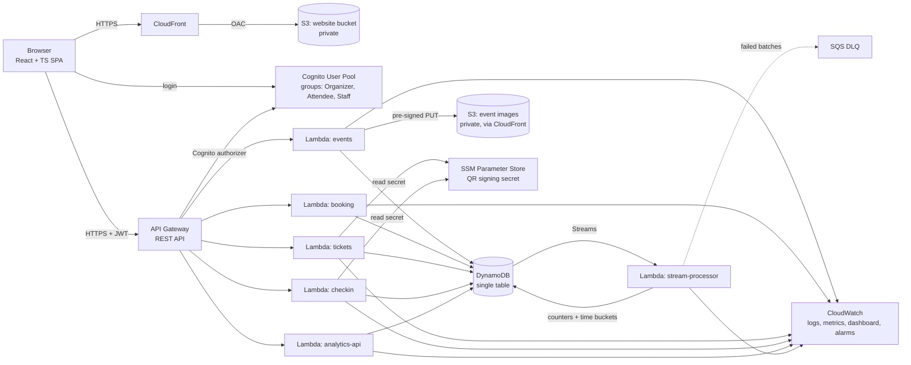
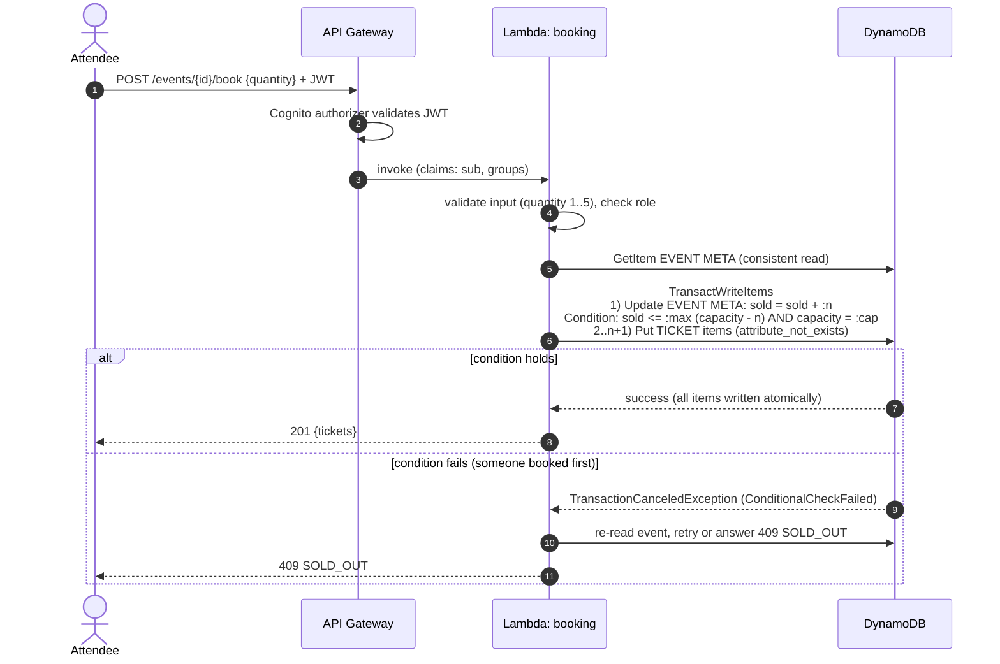
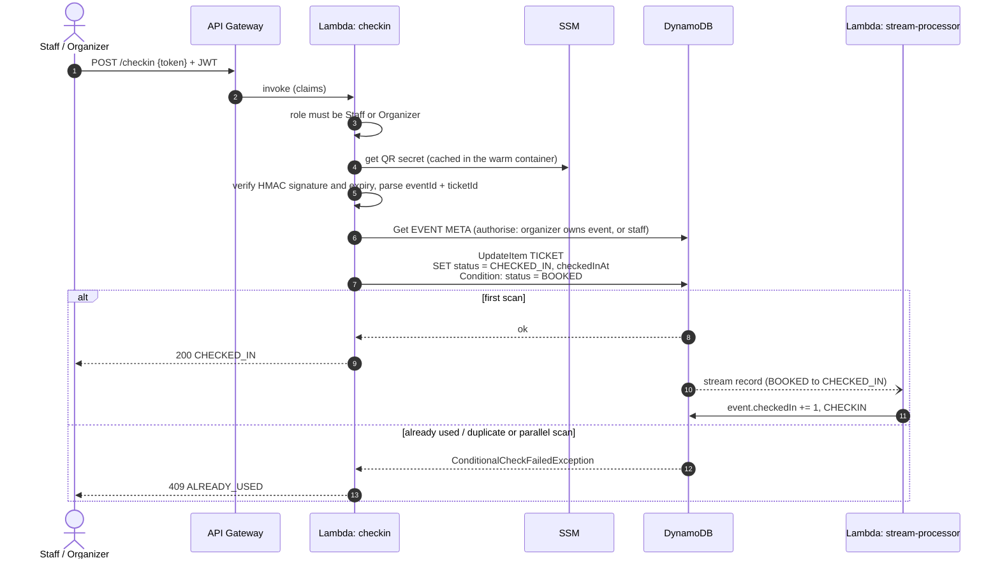

# 02 – Architecture

Region: **us-east-1**. IaC: AWS SAM (`template.yaml`). Runtime: Node.js 22 (arm64), TypeScript. The final diagrams of the deployed system are in [architecture-diagram.md](architecture-diagram.md); the diagram below is the Stage 2 design and omits the monitoring topic, the image CDN and the auth-triggers function.

## 1. Overview

### Request path
Browser → API Gateway (JWT validated by the Cognito authorizer) → one Lambda per resource area → DynamoDB. The frontend never holds AWS credentials. It holds only a Cognito JWT, and the SPA uses Cognito's public client ID (not a secret).

## 2. Components and why

| Component | Role | Why this choice |
|---|---|---|
| S3 + CloudFront | Hosts the SPA over HTTPS | Static, cheap, and CloudFront gives HTTPS (needed for camera access) |
| API Gateway (REST, Cognito authorizer) | Public API, JWT validation, throttling, CORS | The authorizer rejects unauthenticated calls before any Lambda runs |
| Lambda (one per area) | Business logic | No idle cost, scales per request, and one IAM role per function |
| DynamoDB (on-demand, single table) | System of record | Atomic conditional writes and transactions are what make overselling protection possible |
| Cognito | Users, passwords, groups, JWT | Avoids hand-rolling auth |
| SSM Parameter Store | QR HMAC secret | Kept out of code and the template. Only the QR-related functions can read it |
| DynamoDB Streams + Lambda | Maintains check-in counters and time series | Reacts to data changes with no polling and no extra service |
| SQS (DLQ only) | Holds stream batches that keep failing | Gives the alarm something concrete to watch. It is **not** in the main path |
| CloudWatch | Logs, custom metrics, dashboard, alarms | Native and free-tier friendly |

Deliberately **not** used: SES, NAT gateways, VPC, WebSockets, Step Functions, EventBridge, ElastiCache. None gives a benefit at this scale.

## 3. Lambda functions (one IAM role each)

| Function | Routes | Allowed DynamoDB actions | Other |
|---|---|---|---|
| events | `GET/POST /events`, `GET/PUT/DELETE /events/{id}`, `GET /my/events`, `POST /events/{id}/image-url` | Get/Put/Update/Delete/Query on the table | `s3:PutObject` on image bucket prefix |
| booking | `POST /events/{id}/book` | `TransactWriteItems` (Update + Put) | metrics |
| tickets | `GET /my/tickets`, `GET /events/{id}/tickets/{ticketId}/qr` | Query (user index), GetItem | `ssm:GetParameter` (QR secret) |
| checkin | `POST /checkin` | GetItem, UpdateItem (conditional) | `ssm:GetParameter`, metrics |
| analytics-api | `GET /dashboard`, `GET /events/{id}/analytics` | Query, GetItem | read-only |
| stream-processor | (DynamoDB Stream) | UpdateItem | SQS send (DLQ) |

## 4. Booking sequence (overselling protection)

Concurrency: DynamoDB serializes writes to the same item. Two transactions both incrementing `sold` cannot both pass the condition when only one seat remains. No locks, no queue and no read-then-write.

## 5. Check-in sequence

## 6. Security boundaries

- **Edge:** CloudFront serves HTTPS only (redirect HTTP to HTTPS). Both S3 buckets block all public access. The website bucket is readable only by CloudFront (Origin Access Control).
- **API:** every route except public event browsing requires a Cognito JWT. Lambdas additionally check the `cognito:groups` claim and event ownership. CORS is limited to the website's CloudFront domain (local development uses a proxy, L33).
- **Data:** IAM roles are scoped to the specific table, index ARNs and secret path.
- **QR:** the token holds ticket ID, event ID and expiry only. It is HMAC-signed with a secret from SSM. Details are in [06-security.md](06-security.md).

## 7. Scalability and cost notes

- Lambda concurrency and DynamoDB on-demand scale automatically. The demo account's default Lambda concurrency limit is the practical ceiling.
- Hot-key limit: all bookings for one event write one item, and DynamoDB allows about 1,000 writes per second per partition. That far exceeds this project's needs. Beyond it, sharded counters or a queue would be needed (future work).
- Free-tier posture: on-demand DynamoDB, 256 MB or smaller Lambdas, 7-day log retention, no always-on resources. Costs and the cleanup steps are in the README.

## 8. Near real time: polling vs WebSockets

The dashboard polls the analytics endpoint every 5 seconds.

| | Polling (chosen) | WebSockets (API Gateway WS) |
|---|---|---|
| Complexity | One extra GET route | Connection table, `$connect`/`$disconnect`, fan-out Lambda |
| Latency | Up to about 5 s plus stream delay | Sub-second |
| Cost at demo scale | Negligible | Negligible, but more moving parts |
| Failure modes | Few | Stale connections and reconnect logic |

For one organizer watching a dashboard, a 5-second delay is acceptable. WebSockets are listed as future work.
