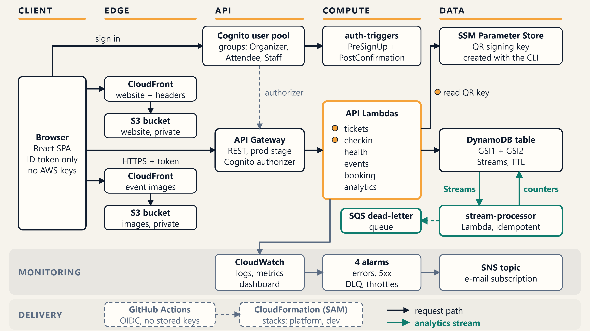
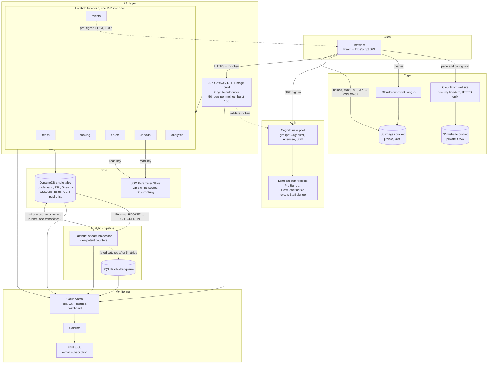
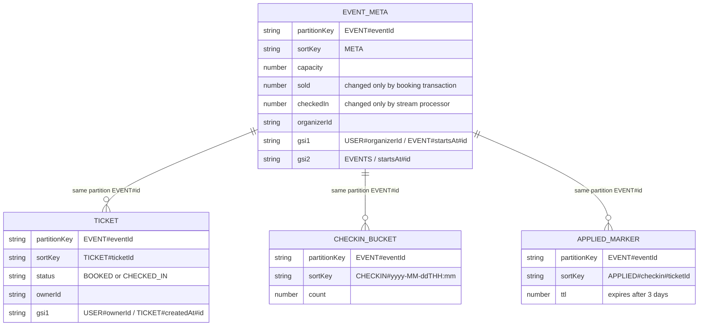
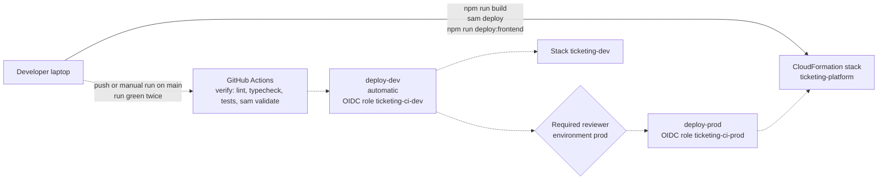

# Architecture diagrams (final)

These show the system **as deployed** in stack `ticketing-platform`, us-east-1. The sequence diagrams for booking and check-in are in [02-architecture.md](02-architecture.md). Mermaid renders on GitHub and in VS Code with a Mermaid extension. PNG renders of every diagram are in [diagrams/](diagrams/) (made with mermaid-cli; see the README there).

## Final architecture (presentation version)

Vector version: [diagrams/architecture-clean.svg](diagrams/architecture-clean.svg). Regenerate both with `node scripts/render-architecture.mjs`.

How to read it, and where each box comes from in `template.yaml`:
- **Request path (dark arrows), left to right:** Browser, then CloudFront + S3 (website and images, `WebDistribution`, `WebBucket`, `ImagesDistribution`, `ImagesBucket`), then API Gateway (`Api`, stage `prod`, Cognito authorizer), then the six API Lambdas (`HealthFunction`, `EventsFunction`, `BookingFunction`, `TicketsFunction`, `CheckinFunction`, `AnalyticsFunction`), then the DynamoDB table (`TicketingTable`, `GSI1`, `GSI2`, Streams, TTL).
- **Sign-in:** the browser talks to the Cognito user pool (`UserPool`, groups `OrganizerGroup`, `AttendeeGroup`, `StaffGroup`), whose triggers are `AuthTriggersFunction`. The user pool is also what the API authorizer checks tokens against.
- **Orange dots:** only `tickets` and `checkin` have permission to read the QR signing key (`ssm:GetParameter` in their policies). **The SSM parameter itself is not in the template**: it is created once with the AWS CLI and only its name is a stack parameter.
- **Teal path (second path):** DynamoDB Streams feed `StreamProcessorFunction`, which writes the counters and per-minute buckets back to the table; failed batches go to `StreamDeadLetterQueue`.
- **Monitoring strip:** one arrow from the Lambda group to CloudWatch (logs, metrics, `OverviewDashboard`), then the four alarms, then `AlarmTopic` (SNS e-mail). The alarms also watch API Gateway, DynamoDB and the dead-letter queue, which the picture does not draw, to keep it readable.
- **Delivery strip (dashed, outside the template):** GitHub Actions with OIDC deploys through CloudFormation (SAM) to the two stacks, `ticketing-platform` and `ticketing-dev`.

The three older diagrams below show more detail (every Lambda, the data model, the delivery flow) and are kept as they were.

## 1. System overview

Notes
- The browser holds only a Cognito ID token (sessionStorage) and public ids from `config.json`. It never holds AWS credentials or the QR secret.
- Each Lambda has its own IAM role. The stream processor's role is written out explicitly and limited to this table's stream.
- Metrics are written as Embedded Metric Format log lines, so there is no `PutMetricData` call and no extra permission.

## 2. Data model (single table)

(`partitionKey` and `sortKey` are the table's `PK` and `SK`; the ER notation reserves those two words.)

## 3. Deployment and delivery

The dashed pipeline path has run green twice: once started by hand, once by a push to `main`. The solid path (laptop to stack) is what every deploy in Stages 3 to 9 used. See [ci-cd-setup.md](ci-cd-setup.md).
