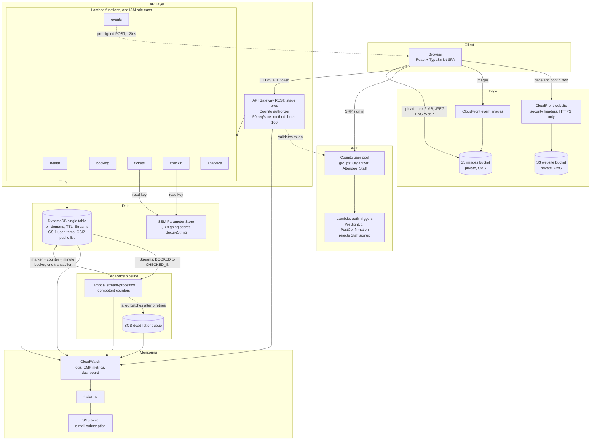
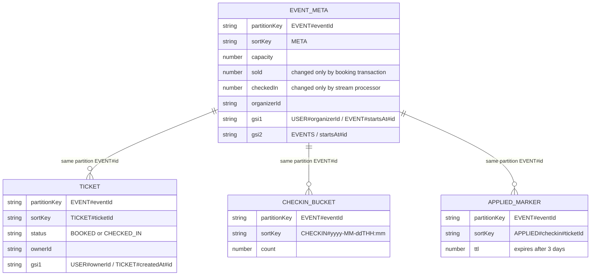
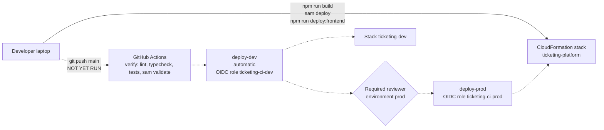

# Architecture diagrams (final)

These show the system **as deployed** in stack `ticketing-platform`, us-east-1. The sequence diagrams for booking and check-in are in [02-architecture.md](02-architecture.md). Mermaid renders on GitHub and in VS Code with a Mermaid extension. PNG renders of every diagram are in [diagrams/](diagrams/) (made with mermaid-cli; see the README there).

## 1. System overview

Notes
- The browser holds only a Cognito ID token (sessionStorage) and public ids from `config.json`. It never holds AWS credentials or the QR secret.
- Each Lambda has its own IAM role. The stream processor's role is written out explicitly and limited to this table's stream.
- Metrics are written as Embedded Metric Format log lines, so there is no `PutMetricData` call and no extra permission.

## 2. Data model (single table)

(`partitionKey` and `sortKey` are the table's `PK` and `SK`; the ER notation reserves those two words.)

## 3. Deployment and delivery

Dashed lines are **written but never run**. The solid path (laptop to stack) is what every deploy in Stages 3 to 9 used. See [ci-cd-setup.md](ci-cd-setup.md).
